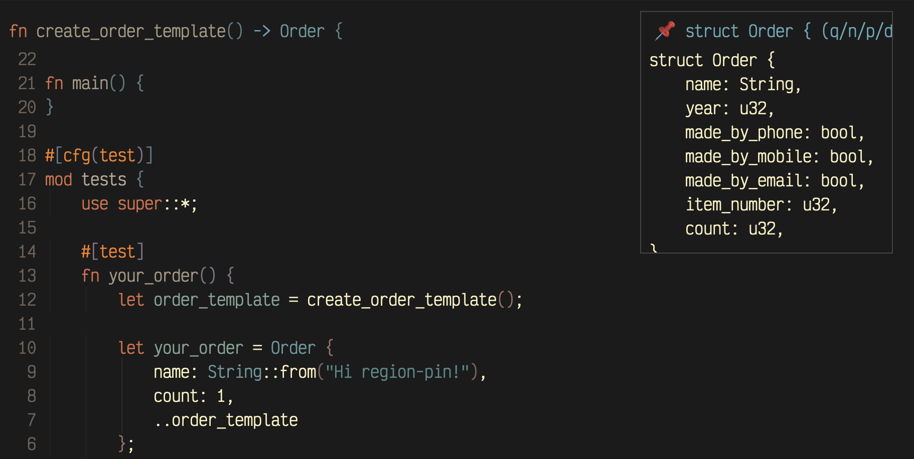

# region-pin.el

<div align="center">
  
  <p><em><code>region-pin</code> demo</em></p>
</div>

---

## The problem this solves:
You're editing code that uses a long struct, enum, function (or any other chunk of code)
defined somewhere far away, in another file, and you keep
jumping back and forth to remember the field or arg names. `region-pin` lets you save
that snippet once under a name, then preview a
floating preview of it in the corner of your window. 

You don't even have to find it yourself: `region-pin-follow` will find the
definition for you (via [dumb-jump](https://github.com/jacktasia/dumb-jump)) and
float it instantly, without moving your cursor or opening a new window.

#### Why not just split the window?

This was the design of *v0.1.0*, and it wasted space. A full-width split
ends up showing a huge blank margin of unused space next to the snippet you actually want.
When you already have a complicated window configuration, adding another gets even messier.

**Note:** Terminal Emacs doesn't support child frames, in this case it
automatically falls back to the original design.

#### ..LSP?
LSP definitely solves this easily. However it's a heavy solution
for a simple task. And also, not everyone wants to use LSP, I certainly prefer
lighter alternatives when they exist.

## Install with `package-vc-install` (Emacs 29+)

```elisp
(use-package region-pin
  :vc (:url "https://github.com/vmargb/region-pin/"))
```

Or with `use-package` + `:load-path`:

```elisp
(use-package region-pin
  :load-path "~/path/to/region-pin/")
```

## Keybindings

```elisp
(global-set-key (kbd "C-c p i") #'region-pin-instant) ; instantly pin region (without a name)
(global-set-key (kbd "C-c p p") #'region-pin-save)    ; save region with a name
(global-set-key (kbd "C-c p s") #'region-pin-show)    ; show a saved/named region
(global-set-key (kbd "C-c p h") #'region-pin-hide)    ; hide any existing region pins
(global-set-key (kbd "C-c p n") #'region-pin-next)    ; go to next named region
(global-set-key (kbd "C-c p P") #'region-pin-previous); go to previous named region
(global-set-key (kbd "C-c p d") #'region-pin-delete)  ; delete a named region
(global-set-key (kbd "C-c p f") #'region-pin-follow)  ; find + pin definition at point
```

## Auto-find (requires `dumb-jump`)

`region-pin-follow` looks up the symbol at point with
[dumb-jump](https://github.com/jacktasia/dumb-jump) and floats the definition it
finds, the same way as `region-pin-instant`.

By default it tries to capture the whole enclosing definition
(`beginning-of-defun`/`end-of-defun`), and falls back to a flat number of lines(`region-pin-follow-lines`)
instead if that fails. 

## Customization (defaults)

```elisp
(setq region-pin-position 'top-right)  ; 'top-right (default), 'top-left, 'top-center
(setq region-pin-max-width 80) 
(setq region-pin-max-height 20)
(setq region-pin-margin 12)            ; gap in pixels from the window edge
(setq region-pin-header-icon "📌")     ; set to just "" to disable the icon
(setq region-pin-follow-lines 15)      ; fallback line count for region-pin-follow
```